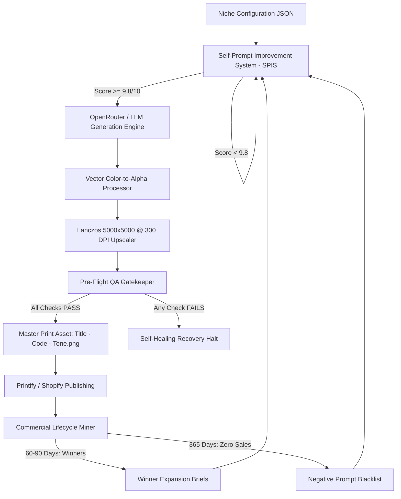

# Universal Apparel Design Engine (UADE)
*Autonomous, Niche-Agnostic Apparel Generation, Vector Background Unmixing & Quality Assurance Pipeline*

[](LICENSE)
[](https://python.org)
[]()
[]()

---

## 🚀 Overview

The **Universal Apparel Design Engine (UADE)** is a production-grade framework designed to autonomously research, generate, process, and validate commercial-grade apparel graphics for Direct-to-Garment (DTG) and screen printing.

Unlike generic image-generation scripts that produce uncalibrated or unusable artwork, UADE guarantees:
1. **Zero Typography Loss:** Eliminates photographic AI background removers (like U2Net/rembg) in favor of **Mathematical Color-to-Alpha Unmixing**, preserving 100% of fine fonts, stars, and filigree.
2. **True 5000×5000 px @ 300 DPI Canvas:** Automatic Lanczos upscaling to 85–90% chest fill.
3. **Automated Pre-Flight Quality Assurance:** Rejects undersized, clipped, or halo-fringed assets before they reach your storefront.
4. **Closed-Loop Commercial Feedback:** Mines live sales velocity from Shopify and Printify to double down on 2–3 month bestsellers and prune 1-year zero-sale dead stock.
5. **Universal Niche Portability:** Switch from Slow-Burn Romance to Gym/Fitness, Coffee, or Cyberpunk simply by selecting a JSON configuration file.

---

## 🏗️ System Architecture



---

## 📦 Key Pillars

### 1. Self-Prompt Improvement System (SPIS)
Pre-evaluates candidate prompts against commercial apparel criteria (Rule of One, arched header, horizontal baseline, solid font fills, storybook woodcut engraving, clean negative space, and explicit omission of t-shirt mockups or human models). Automatically refines prompts until they achieve $\ge 9.8/10$.

### 2. Mathematical Color-to-Alpha Unmixing
Photographic segmentation models treat surrounding typography as "background clutter." UADE solves this using vectorized Color-to-Alpha de-fringing:
$$\alpha = \text{clip}\left(\frac{\text{dist} - t_{\text{low}}}{t_{\text{high}} - t_{\text{low}}}, 0, 1\right)$$
$$C_{\text{clean}} = \frac{C - (1 - \alpha) C_{\text{background}}}{\alpha}$$
Result: 100% letter body preservation with zero white or black edge halo on garments.

### 3. Pre-Flight Quality Assurance Gatekeeper
Every single asset is programmatically inspected before saving:
- **Dimensions & Mode:** Strictly `5000 × 5000 px`, `RGBA`, `300 DPI`.
- **Chest Coverage:** Artwork bounding box must occupy **80%–95%** (`4000px` to `4750px`) of canvas.
- **Perimeter Transparency:** Outer 15px border alpha must strictly equal `0`.
- **Typography Span Preservation:** Compares raw vs processed vertical content span to guarantee text banners were not excised.

### 4. Commercial Sales Feedback Loop
Mines live order fulfillment data from **Shopify Admin API** and **Printify Orders API**:
- **2–3 Month Horizon:** Detects top-velocity bestsellers and extracts their creative DNA to generate companion designs.
- **1-Year Horizon:** Flags zero-sale dead stock for Shopify deactivation and blacklists those tropes in the SPIS prompt engine.

---

## 🛠️ Installation

```bash
# Clone the repository
git clone https://github.com/JawadStudioVision/UniversalApparelDesignEngine.git
cd UniversalApparelDesignEngine

# Create virtual environment
python -m venv venv
source venv/bin/activate  # On Windows: venv\Scripts\activate

# Install dependencies
pip install -r requirements.txt

# Configure environment variables
cp .env.example .env
```

---

## 🚦 Quickstart & CLI Usage

### 1. Generate a Master Print Asset
```bash
python main.py generate \
  --niche romance \
  --subject "Two swallows perched intimately close on a bare winter branch with 1mm beak gap" \
  --header "ALMOST IS" \
  --footer "MY FAVORITE PART" \
  --title "Almost Favorite Part" \
  --code "TG01" \
  --tone "light"
```

### 2. Process an Existing Raw Graphic
```bash
python main.py process \
  --input "raw_art.png" \
  --output "exports/Favorite Part - TG01 - light.png"
```

### 3. Run Pre-Flight QA Gatekeeper on an Asset
```bash
python main.py qa --file "exports/Favorite Part - TG01 - light.png"
```

### 4. Run Commercial Sales Audit
```bash
python main.py sales-audit
```

---

## 🎨 Adding a New Niche

Creating a new brand niche requires only a single JSON file in `config/niches/<niche_id>.json`:

```json
{
  "niche_id": "coffee",
  "niche_name": "Artisanal Coffee & Morning Rituals",
  "visual_style": "Vintage botanical etching with fine cross-hatching",
  "colorways": {
    "light": {
      "ink_palette": "Deep espresso brown with roasted hazelnut accents",
      "background": "Solid pure white background (#FFFFFF)"
    },
    "dark": {
      "ink_palette": "Luminous oat milk cream linework",
      "background": "Solid pure black background (#000000)"
    }
  }
}
```

---

## 🧪 Running Unit Tests

```bash
python tests/test_universal_pipeline.py
```

---

## 📄 License

Distributed under the **MIT License**. See [`LICENSE`](LICENSE) for more information.
