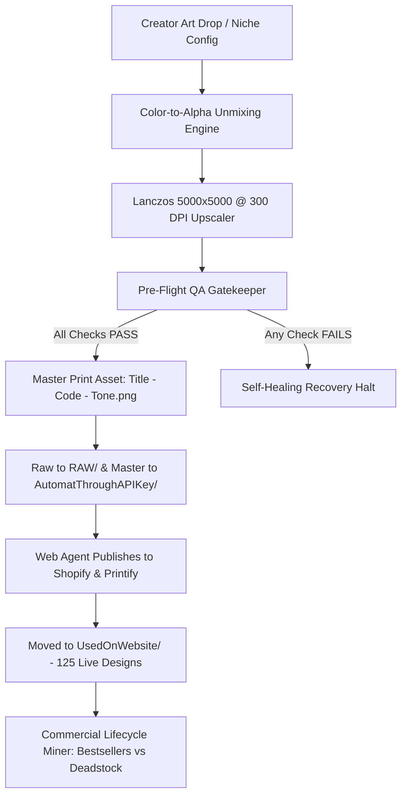

# Universal Apparel Design Engine (UADE)
*Autonomous, Niche-Agnostic Apparel Generation, Vector Background Unmixing & Quality Assurance Pipeline*

[](LICENSE)
[](https://python.org)
[]()
[]()
[]()

---

## 🚀 Overview

The **Universal Apparel Design Engine (UADE)** is a production-grade framework designed to autonomously research, process, and validate commercial-grade apparel graphics for Direct-to-Garment (DTG) and screen printing.

Unlike generic image-generation scripts that produce uncalibrated or unusable artwork, UADE guarantees:
1. **Zero Typography Loss:** Eliminates photographic AI background removers (like U2Net/rembg) in favor of **Mathematical Color-to-Alpha Unmixing**, preserving 100% of fine fonts, stars, and filigree.
2. **True 5000×5000 px @ 300 DPI Canvas:** Automatic Lanczos upscaling to 85–90% chest fill.
3. **Automated Pre-Flight Quality Assurance:** Rejects undersized, clipped, or halo-fringed assets before they reach your storefront.
4. **Manual & Hybrid Creator Workflow:** Supports 100% creator-guided manual design ingestion (`DesignedImages/New Designs 2`) with automated zero-cost local post-processing.
5. **Multi-Agent Staging Pipeline:** Automates archiving to `RAW/`, staging to `AutomatThroughAPIKey/`, and cataloging in `UsedOnWebsite/` (125 live designs).
6. **Strict Non-Violence Brand Policy:** Zero weapons, zero blood, zero toxicity; pure emotional and literary resonance.

---

## 🏗️ System Architecture



---

## 📦 Key Pillars

### 1. Manual Creation & Local Ingestion Workflow
Creators drop high-resolution raw designs into `DesignedImages/New Designs 2`. The local Python pipeline handles background unmixing, resolution density tagging (300 DPI), canvas centering, and quality assurance without third-party API costs.

### 2. Mathematical Color-to-Alpha Unmixing
Photographic segmentation models treat surrounding typography as "background clutter." UADE solves this using vectorized Color-to-Alpha de-fringing:
$$\alpha = \text{clip}\left(\frac{\text{dist} - t_{\text{low}}}{t_{\text{high}} - t_{\text{low}}}, 0, 1\right)$$
$$C_{\text{clean}} = \frac{C - (1 - \alpha) C_{\text{background}}}{\alpha}$$
Result: 100% letter body preservation with zero white or black edge halo on garments.

### 3. Pre-Flight Quality Assurance Gatekeeper
Every single asset is programmatically inspected before saving:
- **Dimensions & Mode:** Strictly `5000 × 5000 px`, `RGBA`, `300 DPI`.
- **Chest Coverage:** Artwork bounding box must occupy **80%–95%** (`4000px` to `4750px`) of canvas.
- **Perimeter Transparency:** Outer 15px border alpha must strictly equal `0`.
- **Typography Span Preservation:** Compares raw vs processed vertical content span to guarantee text banners were not excised.

### 4. Style Reference Mining
Extracts aesthetic pillars from reference design archives:
- Circular botanical wreath / arch badge enclosures
- Multi-tier typography with bookend dashes (`— PHRASE —`)
- Luminous filament linework and starlight ribbons
- Storybook crosshatch and warm reading textures

---

## 🚦 Quickstart & CLI Usage

### 1. Process an Existing Raw Graphic (Local & Free)
```bash
python main.py process \
  --input "raw_art.png" \
  --output "exports/Favorite Part - TG126 - Light.png"
```

### 2. Run Pre-Flight QA Gatekeeper on an Asset
```bash
python main.py qa --file "exports/Favorite Part - TG126 - Light.png"
```

### 3. Run Commercial Sales Audit
```bash
python main.py sales-audit
```

---

## 📄 License

Distributed under the **MIT License**. See [`LICENSE`](LICENSE) for more information.
